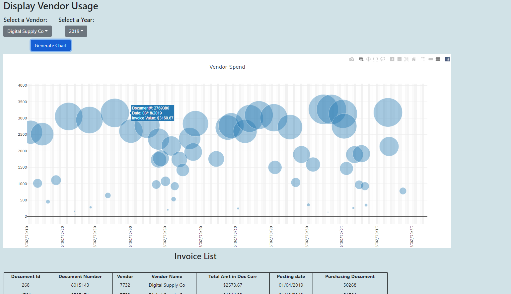

# plotly_dash
<h3>Plotly chart with dynamic data!</h3>
 
<strong>Project Description</strong> 
Dynamic plotly bubble graph using randomized data to show proficientcy in developing web applications and making data visualizations.  
<strong>Tools:</strong> 
-Python 
-Flask 
-Javascript 
-D3 
-Plotly 

<h1><a href="http://plotlychart.herokuapp.com/">SEE IT LIVE HERE!</a></h1>

 

